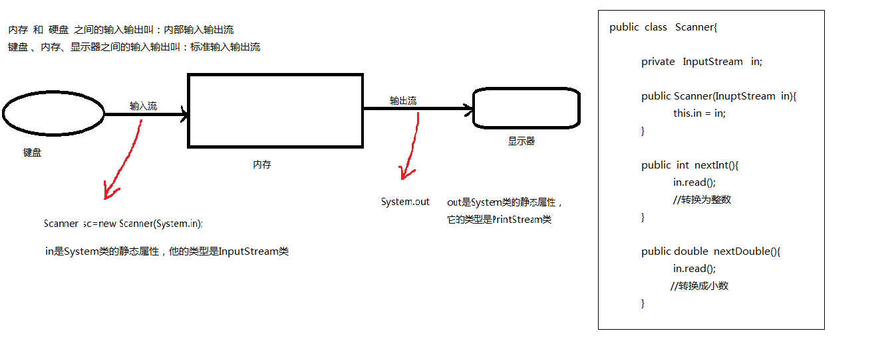

JavaIO 总结笔记<四> 打印流、Properties类、对象流、序列化

一、打印流

1.我们以前在写数据时，不管用什么流，都需要调用什么方法？
```markdown
write(int )
write(byte[])
write(char[])
write(String)
```
我想直接向文件中写入int数据、char数据、boolean数据、小数，怎么实现？

我们之前学的write()方法在写数据时，对数据的类型是有限制的，一般都是先转换为String,然后就可以写入了

为了解决这个问题，Java专门提供了打印流，提供了一些独有的方法，可以直接输出(写)各种类型的数据

2.类型

PrintStream  字节打印流类  继承自OutputStream

PrintWriter   字符打印流类   继承自Writer

3.PrintStream类

- 构造方法
```markdown
public PrintStream(File file)
public PrintStream(String fileName)
```

- 功能方法
```markdown
print()
println()
```

4.PrintWriter类

- 构造方法
```markdown
public PrintWriter(File file)
public PrintWriter(String fileName)
```

- 功能方法
```markdown
public void print(Xxx  x)
public void println(Xxx  x)
```

代码举例：

```java

/**
 * Created by AFinalStone on 2017/6/29.
 */
public class PrintDemo {

    public static String fileName_destination = "PrintDemo.java";

    public static void writeByPrintStream() throws IOException {
        int score = 100;
        double price = 100.9;

        //演示PrintStream类
        //1.建管道
        PrintStream ps = new PrintStream(fileName_destination);
        //2.写数据
        ps.println(score);
        ps.println(price);
        ps.println("writeByPrintStream");

        //3.关闭
        ps.close();
    }

    public static void writeByPrintWriter() throws IOException {
        //1.建管道
        PrintWriter pw = new PrintWriter(fileName_destination);

        //2.写数据
        pw.println(100);
        pw.println(100.9);
        pw.println("writeByPrintWriter");

        //3.关闭
        pw.close();
    }
}

```

二、标准输入输出流



三、Properties类

1.扩展名是.properties的文件叫属性配置文件，它也是文本文件的一种

2.特点：一行一个键值对

3.Properties = HashMap  +  IO

4.构造方法   无参

5.功能方法

```markdown
public Object setProperty(String key,String value) //put()
public String getProperty(String key)   //get()
public Set<String> stringPropertyNames()  //keySet()

public void list(PrintWriter out)  //把键值对放到输出流中(写)
public void store(Writer writer, String comments) //多了个备注
public void load(Reader reader)    //把属性文件中的键值对放到输入流中(读)

```
代码举例：

```java

/**
 * Created by AFinalStone on 2017/6/29.
 */
public class PropertiesDemo {

    public static void writeProperties01() throws IOException {
        //演示Properties类   Properties = HashMap  +  IO

        //1.创建对象
        Properties prop=new Properties();

        //2.往属性配置文件中写键值对
        prop.setProperty("name", "AFinalStone");
        prop.setProperty("pwd", "12345");
        prop.setProperty("email", "AFinalStone@gmail.com");

		//3.把键值对写到文件中    list
		PrintWriter pw=new PrintWriter("demo.properties");
		prop.list(pw);

		//4.关闭
		pw.close();

    }

    public static void writeProperties02() throws IOException {
        //演示Properties类   Properties = HashMap  +  IO

        //1.创建对象
        Properties prop=new Properties();

        //2.往属性配置文件中写键值对
        prop.setProperty("name", "AFinalStone");
        prop.setProperty("pwd", "12345");
        prop.setProperty("email", "AFinalStone@gmail.com");

        //3.把键值对写到文件中    store
        FileWriter fw = new FileWriter("demo.properties");
        prop.store(fw, "--这是属性配置文件--");

        //4.关闭
        fw.close();
    }

    public static void readProperties() throws IOException {
        //演示Properties类的load方法

        //1.创建对象
        Properties prop=new Properties();

        //2.读取数据
        FileReader fr=new FileReader("demo.properties");
        prop.load(fr);

        //3.关闭
        fr.close();

        //4.取数据
        Set<String> keys=prop.stringPropertyNames();    //keySet()
        for (String s : keys) {
            String val=prop.getProperty(s);     //get()
            System.out.println(s+"="+val);
        }
    }

}

```

四、对象流

1.简述

- 使用打印流写一个对象时，写进去的其实就是toString方法的返回值
- 序列化        把一个对象写到文件中  
- 反序列化      从一个文件中把对象读取出来
- ObjectInputStream   ObjectOutputStream 
- 在Java中，一个普通类的对象是默认不允许序列化的,如果像让这个类的对象可以序列化，就要求这个类必须实现java.io.Serializable接口,这是第一次见到空接口，起到标记作用

2.ObjectOutputStream类

- 作用
- 构造方法   带有一个参数
- 功能方法
writeObject(Object)

3.ObjectInputStream类

- 作用
- 构造方法   带有一个参数
- 功能方法
readObject()

```java

public class ObjectDemo {

    private static String fileName_Object = "student";


    /**
     * @throws ClassNotFoundException
     * 把对象转换成文件
     */
    public static void ObjectToFileByObjectInputStream() throws IOException, ClassNotFoundException {

        ObjectOutputStream objectOutputStream = new ObjectOutputStream(new FileOutputStream(fileName_Object));
        objectOutputStream.writeObject(new Student("gg", 22));
        objectOutputStream.writeObject(new Student("tt", 18));
        objectOutputStream.writeObject(new Student("rr", 17));
        objectOutputStream.close();
    }


    /**
     * @throws ClassNotFoundException
     * 读取文件里面的Object对象，
     */
    public static void FileToObjectByObjectInputStream() throws IOException, ClassNotFoundException {
        ObjectInputStream objectInputStream = new ObjectInputStream(new FileInputStream(fileName_Object));

        for (int i = 0; i < 3; i++) {
            Object object = objectInputStream.readObject();
            System.out.println(object);
        }
        objectInputStream.close();
    }


}

```

九、序列化号   版本号

1.写过对象后，如果改了类的源码，那么反序列化时会出异常

2.JVM怎么知道我改了源码了？类中默认自动有一个隐藏的属性serialVersionUID，每次修改代码，该属性的值会自动修改

3.把serialVersionUID属性人工的改为final即可

可以参考这篇文章：

[序列化与反序列化的理解](http://blog.csdn.net/abc6368765/article/details/51365838)


